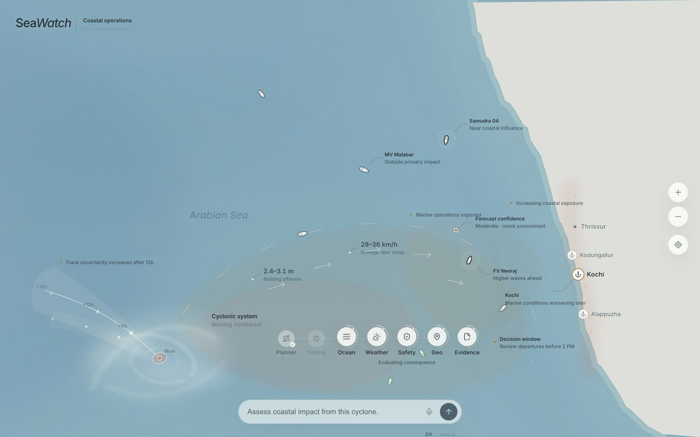
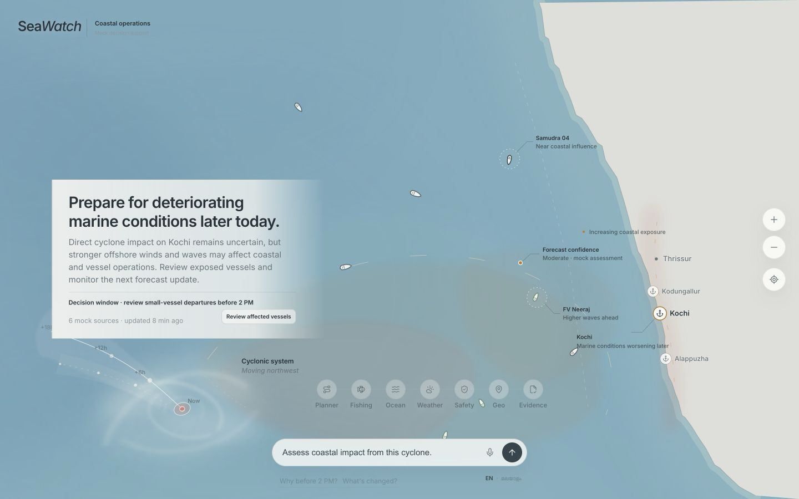

# SeaWatch

> SeaWatch turns the ocean from a map you look at into a system you can ask.

SeaWatch is a map-first marine intelligence prototype centered on Kochi and the Kerala coast. It turns natural-language questions into visible geographic evidence, specialist collaboration, and concise operational recommendations directly on a living ocean canvas.

Built by Team Vega for SIH 2026.



## The problem

Marine decisions are usually split across weather charts, vessel feeds, advisories, and specialist tools. That fragmentation makes it difficult for fishers and coastal authorities to move from “what is happening?” to “what should we do?” quickly and confidently.

SeaWatch composes those concerns into one spatial conversation. The map remains the primary interface: the user can ask a question, select open water, inspect a vessel or cyclone, and watch relevant evidence resolve where it matters.

## Core experience

- A living Kochi and Arabian Sea canvas with restrained ocean depth, current, coastal, vessel, and weather motion
- Direct ocean selection with a finite physical ripple and anchored analysis action
- Conversational fishing guidance with opportunity fields, conditions, timing, and evidence
- Cyclone inspection and coastal-impact assessment
- Affected-vessel review, forecast uncertainty, coastal exposure, and decision windows
- English and Malayalam deterministic voice demonstrations
- Accessible keyboard interaction, focus handling, semantic status, and reduced-motion behavior

## Disaster-management relevance

The coastal-operations experience translates an offshore cyclone into consequences for waves, winds, Kochi, marine operations, and exposed vessels. It preserves forecast uncertainty while presenting a clear review window, making the prototype suitable for demonstrating decision support rather than merely visualizing a storm.



## Multi-agent architecture

Seven visible specialist roles coordinate through a deterministic orchestration layer:

- **Planner** frames the request and chooses expertise.
- **Fishing** evaluates fishing opportunity.
- **Ocean** interprets marine conditions.
- **Weather** evaluates forecast and storm context.
- **Safety** combines evidence into operational risk.
- **Geo** resolves location, coastline, and exposure.
- **Evidence** checks source freshness and confidence.

The collaboration is intentionally inspectable: working states, transfers, completion states, map evidence, and the final recommendation appear as one paced sequence.

## Prototype boundaries

SeaWatch is a deterministic hackathon prototype. Marine readings, vessels, forecasts, source freshness, voice transcription, specialist reasoning, and recommendations are simulated from local scenario data. The project does **not** use live APIs, satellite feeds, vessel feeds, speech recognition, or LLM calls.

## Technology

- React 19 and TypeScript
- Vite
- CSS/SVG environmental rendering and motion
- Lucide React icons
- Inter variable typography with regional-language fallbacks
- Oxlint

## Run locally

```bash
npm install
npm run dev
```

Open `http://localhost:5173/?demo=reset`.

Useful deterministic demo routes:

```text
?demo=reset                  Calm conversational ocean
?demo=hero                   Fishing intelligence story
?demo=disaster               Full disaster assessment
?demo=disaster&state=peak    Disaster analytical peak
?demo=disaster&state=final   Final operational recommendation
?demo=alert                  Operational alert entry point
?styleboard                  Internal design-system reference
```

Press `R` to replay the fishing demonstration. Add `&motion=reduce` to exercise the reduced-motion path.

## Validation

```bash
npm run lint
npm run build
```

Product, visual, motion, conversation, and disaster decisions are documented in [`docs/`](docs/).
